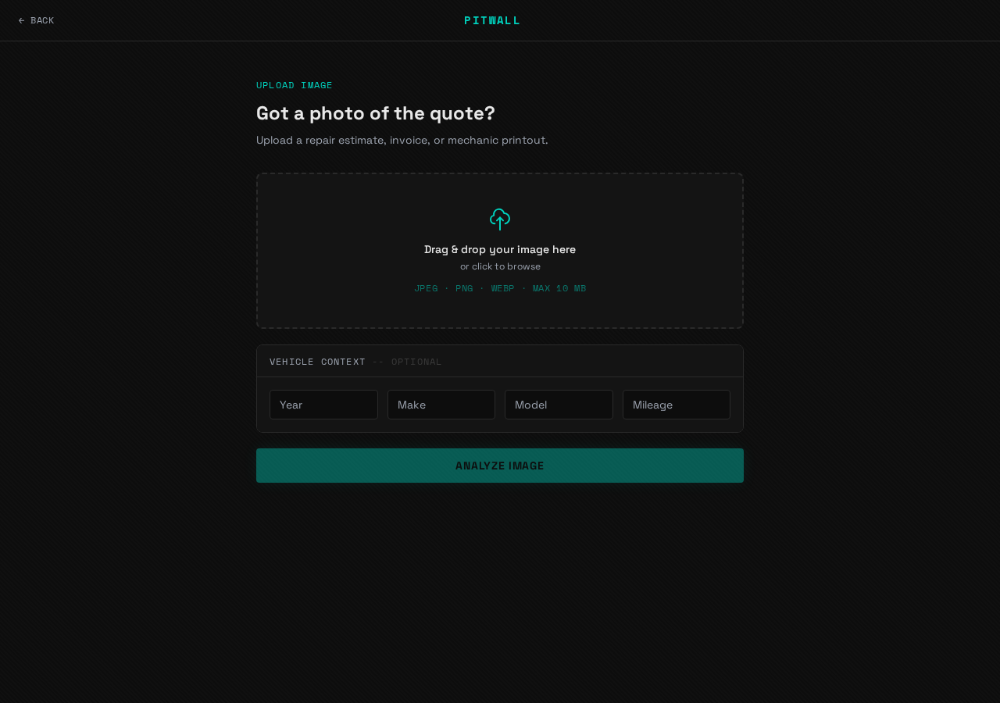
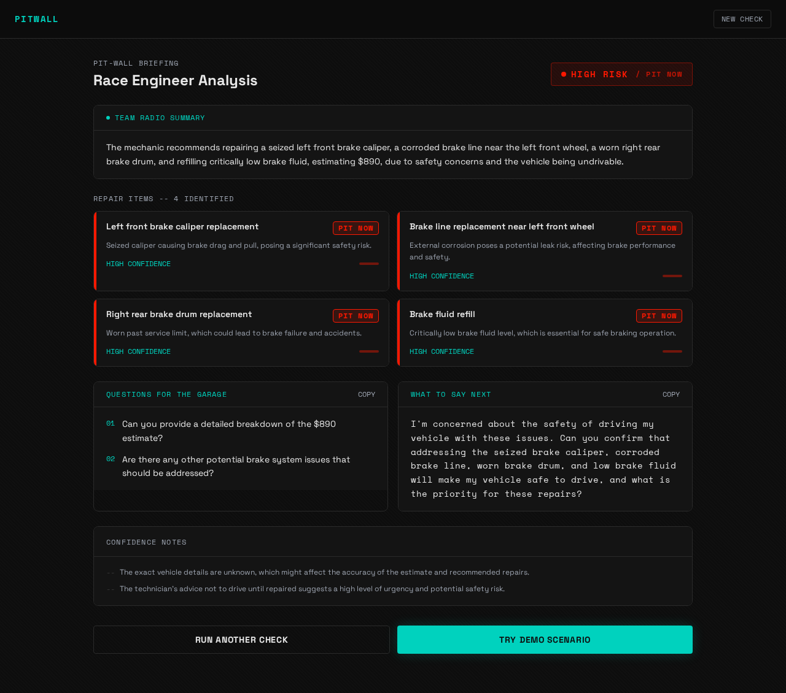

# PITWALL

### An F1-inspired AI repair-decision copilot for drivers who deserve a fair shot.

---


---



---

## The Problem

Every year, millions of drivers sit across from a mechanic they don't fully understand, holding a quote they can't interpret, under pressure to approve work they can't evaluate.

Research shows that **women are disproportionately quoted higher prices** at auto repair shops when they're perceived as uninformed — not because they're less capable, but because information asymmetry is a real and exploitable gap. A well-cited NBER field experiment found women were quoted significantly more than men for the same repair when no expected price was mentioned.

Most people don't know what to ask. Most people don't know what can wait. Most people just say yes.

**PitWall changes that.**

---

## What It Does

PitWall acts as your **AI race engineer** during a repair visit — analyzing mechanic recommendations, separating urgent work from optional upsells, and giving you the exact words to say before you approve anything.

> _In F1, no driver makes a pit stop decision alone. They have a race engineer on the wall reading the data, managing the risk, and calling the play. That's PitWall for everyday drivers._

---



---

## Features

- **Paste or upload a repair quote** — text input, drag-and-drop image upload (JPEG/PNG/WebP), or demo scenario
- **AI analysis in seconds** — text powered by Llama 3.3 70B, image analysis by Llama 4 Scout 17B vision, both via Groq
- **Evidence-based urgency** — PIT NOW / NEXT LAP / MONITOR / UNCLEAR assigned by what's proven, not what's claimed
- **Price reasonableness flag** — typical national cost range shown per repair item so you know if you're being overcharged
- **Confidence qualifier** — tells you how many items are evidenced vs unclear so you know how much to trust the verdict
- **Plain-English explanations** — no mechanic jargon
- **Verification flags** — items that need a second look before approval
- **Questions for the garage** — specific, respectful, evidence-demanding questions to ask
- **What to Say Next** — a calm, confident script tailored to your exact situation
- **Share your briefing** — shareable URL so you can forward the analysis to a friend before approving anything
- **Community approval rates** — see how many other drivers approved or declined each repair, plus average price paid
- **Outcome reporting** — report what you actually paid after the visit; every submission improves data for the next driver
- **8 demo scenarios** — upsell stacks, pressure tactics, legitimate safety issues, and more
- **Live pit checks counter** — every analysis stored to Supabase in real time

---

## Demo Scenarios


PitWall ships with 8 ready-to-run scenarios including:

| Scenario                | What it demonstrates                               |
| ----------------------- | -------------------------------------------------- |
| Urgent Safety Issue     | Legitimate safety repairs backed by evidence       |
| The Oil Change That Grew | $49 visit becomes $954 in pressure                |
| Vague Safety Warnings   | No measurements, no evidence, all urgency          |
| First Car, First Repair | Intimidation tactics on a first-time owner         |
| 100k Service Bundle     | Real maintenance due vs opportunistic additions    |
| Dashboard Warning Lights | Multiple codes — some serious, some not           |
| Post-Accident Add-Ons   | Unrelated items tacked onto a collision repair     |
| Dealer Service Upsell   | New car, $2k checklist after a free oil change     |

---

## F1 Theme

PitWall maps the driver experience to the F1 pit wall model:

| Real World              | PitWall                    |
| ----------------------- | -------------------------- |
| Driver                  | You                        |
| Mechanic recommendation | The incoming data          |
| PitWall app             | Your race engineer         |
| Repair decision         | The pit stop call          |
| PIT NOW                 | Safety-critical, act today |
| NEXT LAP                | Address soon               |
| MONITOR                 | Can wait, keep watching    |
| UNCLEAR                 | Get a second opinion first |

The UI is built on a **Mercedes W14 pit wall aesthetic** — near-black carbon background, platinum silver typography, Petronas teal accents, and Space Mono for all data values.

---

## Tech Stack

| Layer    | Technology                                   |
| -------- | -------------------------------------------- |
| Frontend | Vite + React + TypeScript + Tailwind CSS     |
| UI       | Custom F1 theme (Space Grotesk + Space Mono) |
| Backend  | FastAPI (Python)                             |
| AI (text)  | Llama 3.3 70B via Groq API                 |
| AI (vision)| Llama 4 Scout 17B via Groq API             |
| Database | Supabase (PostgreSQL)                        |
| Routing  | React Router v6                              |

---

## Running Locally

### Prerequisites

- Node.js 18+
- Python 3.11+
- A [Groq API key](https://console.groq.com) (free)
- A [Supabase](https://supabase.com) project

### Backend

```bash
cd backend
python -m venv venv
source venv/bin/activate
pip install -r requirements.txt
```

Create `backend/.env`:

```
GROQ_API_KEY=your_groq_key
SUPABASE_URL=https://your-project.supabase.co
SUPABASE_SERVICE_KEY=your_service_role_key
```

```bash
uvicorn app.main:app --reload
```

### Frontend

```bash
cd frontend
npm install
```

Create `frontend/.env`:

```
VITE_SUPABASE_URL=https://your-project.supabase.co
VITE_SUPABASE_ANON_KEY=your_anon_key
VITE_API_URL=http://localhost:8000
```

```bash
npm run dev
```

Open `http://localhost:5173`

### Database

```bash
supabase link --project-ref your-project-ref
supabase db push
supabase db query -f supabase/seed.sql --linked
```

---

## Project Structure

```
PitWall/
├── frontend/
│   ├── src/
│   │   ├── pages/
│   │   │   ├── LandingPage.tsx
│   │   │   ├── PitCheckPage.tsx
│   │   │   └── BriefingPage.tsx
│   │   └── lib/
│   │       ├── api.ts
│   │       └── supabase.ts
│   └── index.html
├── backend/
│   └── app/
│       ├── main.py
│       ├── routes/
│       │   ├── analyze.py
│       │   ├── briefing.py
│       │   ├── demo.py
│       │   ├── outcomes.py
│       │   └── stats.py
│       ├── services/
│       │   ├── ai_client.py
│       │   └── prompt_builder.py
│       └── schemas/
│           ├── request_models.py
│           └── response_models.py
└── supabase/
    ├── migrations/
    ├── seed.sql
    └── outcomes_seed.sql
```

---

## Built At

**CodeQuantum 2026** — hosted by UTSA
Solo build · 8 hours · F1 Theme + Best Pitch tracks

---

_PitWall is not a legal or mechanical authority. It is an informational decision-support tool. Always consult a qualified mechanic for safety-critical repairs._
